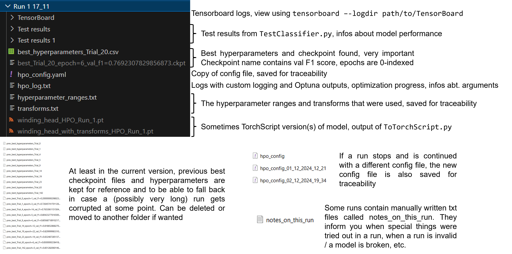
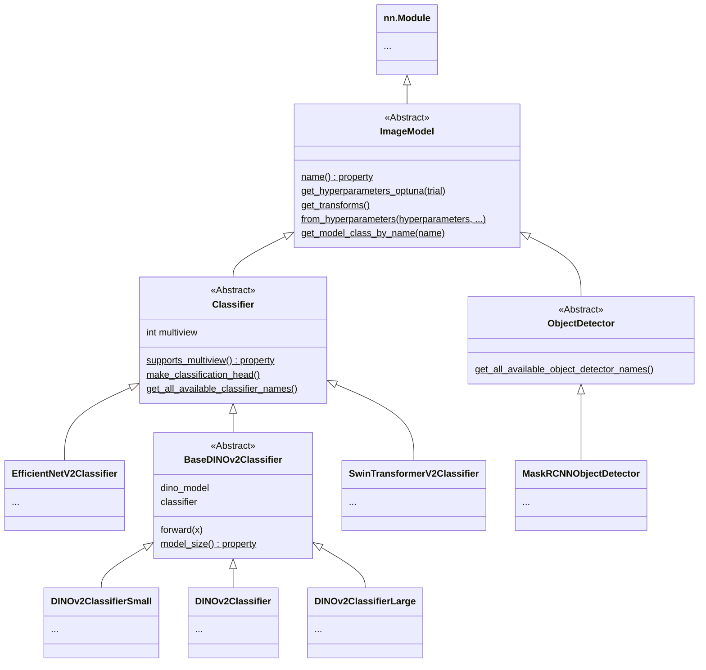

# Custom Deep Learning Vision Suite
## Content 🗺️
- Content 🗺️ (you are here)
- Project summary and disclaimers 👨‍💻
- Project structure 📝
- Scripts 💻
- Structure of HPO results 🔬
- Model architecture and hierarchy🍕
- Environment 🐍

## Project summary and disclaimers
**Diese Skripte und Klassen wurden von mir für meine Bachelorarbeit entwickelt. Sie wurden für bestimmte Use Cases und Datensätze entwickelt und sind für die Anwendung auf andere Datensätze aktuell kaum dokumentiert und getestet. Vor der Veröffentlichung hier wurden Ordner und einzelne Teile der Codebasis entfernt und die Codebasis nicht noch einmal getestet**

Dieses Projekt ist ein Toolkit für Image Classification und Object Recognition mithilfe von Transfer Learning auf Basis von [PyTorch](https://pytorch.org/), [PyTorch Lightning](https://lightning.ai/docs/pytorch/stable/) und [Optuna](https://optuna.org/). Es stellt **Skripte für das Training, die Hyperparameteroptimierung, den Test und die Bereitstellung (TorchScript) von Modellen** bereit. Ziel waren zudem eine verallgemeinerbare und erweiterbare Architektur sowie nachverfolgbare Ergebnisse auch bei vielen verschiedenen Trainings/HPO-Durchläufen. Unterstützt werden **Binary und Multiclass Classification**, insbesondere auch **Multi-View-Classification mit mehreren Bildern** auf einmal sowie **Object Detection**. Aktuell sind als Modelle insbesondere [DINOv2](https://dinov2.metademolab.com/) und [EfficientNetV2](https://pytorch.org/vision/main/models/efficientnetv2.html) für die Bildklassifikation und [Mask R-CNN](https://pytorch.org/vision/main/models/mask_rcnn.html) für die Objekterkennung implementiert.

**These scripts and classes were developed by me for my bachelor's thesis. They were developed for specific use cases and data sets and are currently hardly tested and document for application to other data sets. Before publication some folders and singular parts of the codebase were removed and the codebase was not tested again**

This project is a toolkit for image classification and object recognition using transfer learning based on [PyTorch](https://pytorch.org/), [PyTorch Lightning](https://lightning.ai/docs/pytorch/stable/) and [Optuna](https://optuna.org/). It provides **scripts for training, hyperparameter optimization, testing and deployment (TorchScript) of models**. The goal was also a generalizable and extensible architecture as well as traceable results even with many different training/HPO runs. **Binary and multiclass classification** are supported, in particular also **multi-view classification with multiple images** at once as well as **object detection**. The models currently implemented are [DINOv2](https://dinov2.metademolab.com/) and [EfficientNetV2](https://pytorch.org/vision/main/models/efficientnetv2.html) for image classification and [Mask R-CNN](https://pytorch.org/vision/main/models/mask_rcnn.html) for object recognition.

## Project structure 📝
_(important things are  **bold**)_
- Classification and Object Detection:
	- Scripts
		- **OptimizeModel.py**: Performs hyperparameter optimization for a given model architecture and dataset and produces lots of results. Uses functionality from HyperparameterOptimization.py
		- **TrainAndTestModel.py**: Trains and evaluates a single model with given hyperparameters
		- **TestModel.py**: Evaluates a model checkpoint
		- ToTorchscript.py: Converts a model checkpoint to a TorchScript file
		- OptimizeDataAugmentations.py: Optimizes the parameters of the data augmentations for a given model architecture and set of hyperparameters
		- GenerateGradCAMs.py: Generates GradCAM images using a model and a set of input images
	- Modules
		- **HyperparameterOptimization.py**: Contains the entire hyperparameter optimization logic
		- **LightningImageClassifier.py and LightningObjectDetector.py**: PyTorch Lightning modules for classification and object detection
		- **ImageClassificationDataset.py and ObjectDetectionDataset.py**: PyTorch Dataset classes for classification and object detection
		- DatasetPaths.py: Contains the paths to the datasets and their nicer names for use in configs and args
		- PretrainedModelTransforms.py: Contains the required image transforms for all model architectures. Note that models already determine their own transforms and this could get merged into model hierarchy
		- Utility.py: Utility functions and lookup tables used by all other modules and scripts
	- **Models**: PyTorch implementations of all models using Transfer Learning. For architecture and inheritance hierarchy see diagram further below
	- **Configs**: Config files for hyperparameter optimization
	- **Data Augmentations**: Config files for data augmentations, can be used in TrainAndTestModel.py if needed

## Scripts 💻
Also try `python script.py --help` :)  

Regarding the format of the results of the scripts see the "Results" folder for examples. Will add detailed description at a later point.

All scripts mentioned here _should_ also work for object detection when being passed an object detection model and the "object detection" dataset.
### OptimizeModel
**Basic usage example:**
```bash
python "Classification and Object Detection/OptimizeModel.py" --config "relative/path/to/your/config.yaml" --run_name "My cool run 15_11" --gpu 0 [--allow_continue_run]
```  

This script is responsible for optimizing a model - classifier or object detector - on a given dataset.
It works with all binary and multiclass image classification and object detection models which are implemented.  
It runs hyperparameter optimization for the given model and dataset, and saves the best hyperparameters to a CSV file.  
All parameters, paths, etc. have to be specified in the config file or as arguments.  

The epochs in the checkpoint names are 0-indexed! If you want to retrain a model with e.g. "epoch=6" in its name, you need to train for 7 epochs.

Arguments:  
- config is the path to the configuration file (format see below)
- run_name is a unique run identifier (string) for this HPO run. Set manually.
- gpu is the GPU to use for training. Usually 0 or 1.
- allow_continue_run is a flag. Whether to allow continuing an existing run with the same name. Optional, default is False.
- use_grad_acc is a flag. Whether to use gradient accumulation. Optional, default is False.
- grad_acc_partial_batch_size is the partial batch size for gradient accumulation. Optional, default is 4.
- dataloaders_num_workers is the number of workers for the dataloaders. Optional, default is 8.
- dataloaders_no_persistent_workers is a flag. Usually persistent workers are used for the dataloaders. This disables that. Optional, default is False.
- logging_level is the logging level for the script (DEBUG, INFO, WARNING, ...). Optional, default is INFO.

The script will create a subdirectory for the run in the results directory and save the best checkpoints and hyperparameters to a CSV file.  
An Optuna SQLite database will always be created or accessed, see config.  
The script will also create a TensorBoard folder and a log file for the run and log the hyperparameter ranges and transforms that were used.  

**Basic config structure:**  
_(see the existing configs for examples)_
```yaml
model: model name, e.g. DINOv2, MaskRCNN, see Models folder
dataset: dataset name, see DatasetPaths.py
classification_multiview: optional, required for classification, whether to use a multiview model and dataset
results_path: where to put the run results, logs, etc. script will create a subfolder with the run_name as name

hpo:
  trials: how many Optuna trials, eg. 10, 30, 50, 100, 200, ...
  use_pruning: whether to use Optuna pruning, usually true is fine
  pruning_n_startup_trials: see Optuna docs, 5 is good
  pruning_n_warmup_steps: see Optuna docs, 4 is good
  optuna_database_path: optional, where to put the Optuna SQLite database. if none is provided, script puts it under results_path

training:
  epochs: how many epochs to train for (max)
  use_early_stopping: whether to use early stopping, usually true is fine
  early_stopping_patience: see infos on early stopping online, usually ~8 is fine, might need some tweaking
```

###  TrainAndTestModel
**Basic usage example:**
```bash
python "Classification and Object Detection/TrainAndTestModel.py" --model DINOv2 --dataset cover --hyperparameters "path/to/hp/csvfile/hyperparameters.csv" --epochs 30 --results_path "your/cool/results/path/Single Training Fixed HPs 15_11" --gpu 0
```
This module / script contains the train_and_test_model_with_fixed_hyperparameters function, 
which trains a classifier with fixed hyperparameters and evaluates it on the test (and validation) set(s).  
Usually this function combines the train and validation set into one new train set and trains on that.  
When used as a script it executes the function and saves the results using the following command line arguments:
- model: The type of model to train.
- classification_multiview: Flag. Whether to use a multiview model and dataset for classification.
- dont_combine_train_val: Flag. Whether to not combine train and validation set for training and only train on the train set. By default, train and val are combined into new train set.
- hyperparameters: Path to the hyperparameters csv file.
- dataset: The dataset to use for training as specified under "Classification and Object Detection/Datasets.py".
- epochs: Number of epochs to train the model for.
- results_path: Path to the directory where the results should be saved.
- data_augmentations: Path to a yaml file with parameters for the data augmentations. For the format, see the files under "Classification and Object Detection/Data Augmentations". If none is specified, will use a set of default augmentations.
- gpu: GPU to use for training. Usually 0 or 1.
- early_stopping_patience: Number of epochs without improvement after which training is stopped.
- dataloaders_num_workers: Number of workers for the dataloaders.
- dataloaders_persistent_workers: Flag. Whether to use persistent workers in the data loaders.
- use_grad_acc: Flag. Whether to use gradient accumulation.
- grad_acc_partial_batch_size: Partial batch size for gradient accumulation.
- logging_level: Logging level for the script (DEBUG, INFO, WARNING, ...).

### TestModel
**Basic usage examples:**
```bash
python TestClassifier.py --model DINOv2 --checkpoint "path/to/model.ckpt" --hyperparameters "path/to/hp/csvfile/hyperparameters.csv" --results_path "your/cool/results/path/My model training" --dataset xyz --gpu 0

# If you have a directory with the outputs of OptimizeModel or TrainAndTestModel, you can pass it directly to TestClassifier and the script will find everything it needs
python TestClassifier.py --model DINOv2 --run_path "path/to/the/results/of/HPO_run/HPO 1" --dataset xyz --gpu 0
```

This script trains and tests/evaluates a model checkpoint for binary or multiclass image classifiation or object detection with specified model hyperparameters on a specified dataset and outputs the test and validation results along with other information like misclassified samples for binary classification tasks.

## Structure of HPO results 🔬
The below figure explains the outputs of `OptimizeModel.py`. Some of these infos are the same for `TrainAndTestModel.py`.  


## Model architecture and hierarchy 🍕


## Environment 🐍
Python 3.11.9  
Recommended Conda installs:  
```
conda install numpy Pandas matplotlib
conda install pytorch=2.5.0 torchvision=0.20.0 torchaudio pytorch-cuda=12.4 -c pytorch -c nvidia
conda install ipykernel openpyxl ipywidgets
conda install scikit-learn=1.5.1
conda install lightning=2.4.0 -c conda-forge
conda install -c conda-forge optuna=4.0.0 optuna-dashboard=0.16.1 optuna-integration=4.0.0
conda install tensorboard
conda install -c conda-forge torchmetrics
conda install -c conda-forge pycocotools=2.0.8
conda install -c conda-forge grad-cam=1.5.4 (caused problems during install in the past)
```
Full list of important packages according to conda list:
```
ipykernel
Lightning 2.4.0 conda-forge
matplotlib
numpy
optuna 4.0.0 conda-forge
optuna-dashboard 0.16.1 conda-forge
optuna-integration 4.0.0 conda-forge
pandas
pycocotools 2.0.8 conda-forge
pytorch 2.5.0 py3.11_cuda12.4 pytorch
(pytorch-cuda 12.4)
scikit-learn 1.5.1
torchmetrics 1.5.1 conda-forge
torchvision 0.20.0
tensorboard
openpyxl
ipywidgets
grad-cam 1.5.4 conda-forge

(pytorch-lightning 2.4.0 conda-forge)
(plotly)
(seaborn)
(scipy)
(pillow)
```
mmpretrain and mmcv for SwinTransformerV2 have to be installed in a seperate environment running torch=2.3.x
